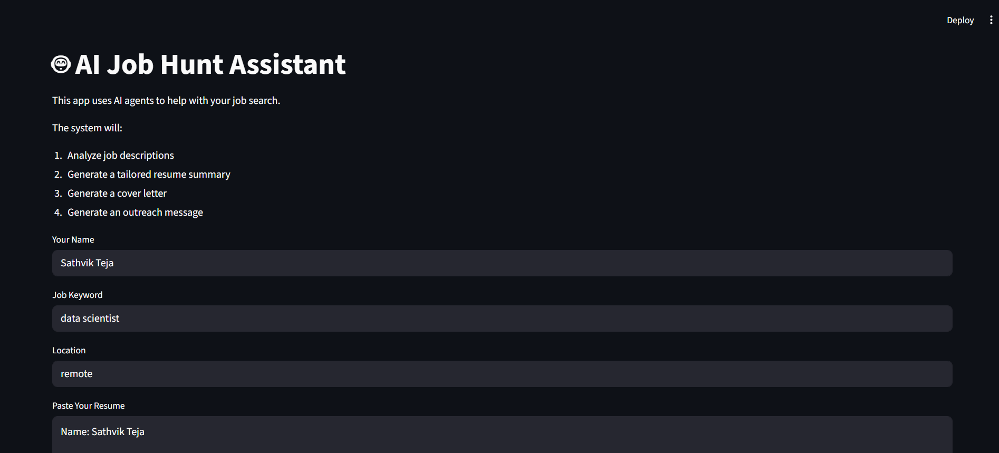
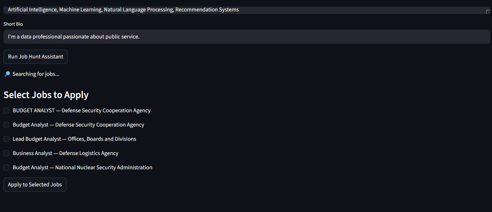
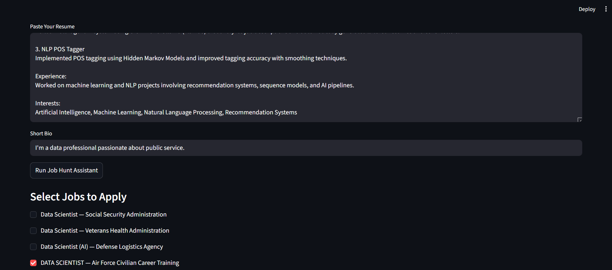
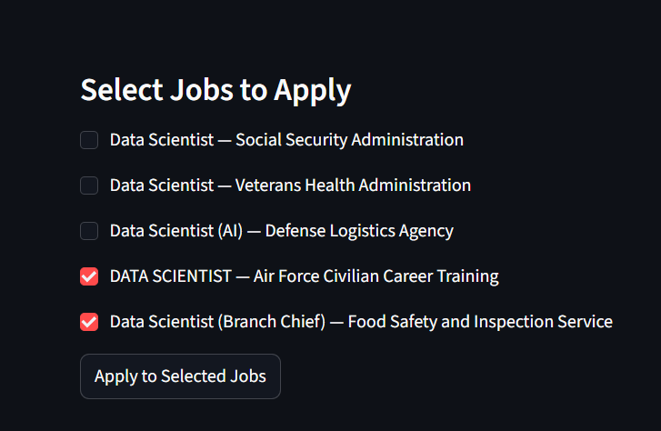
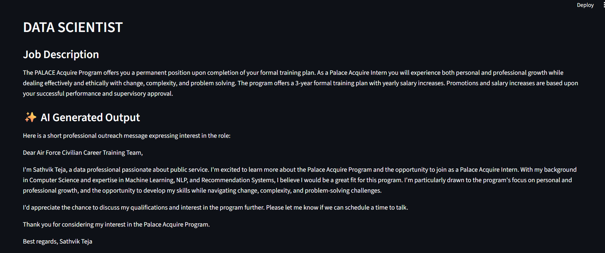
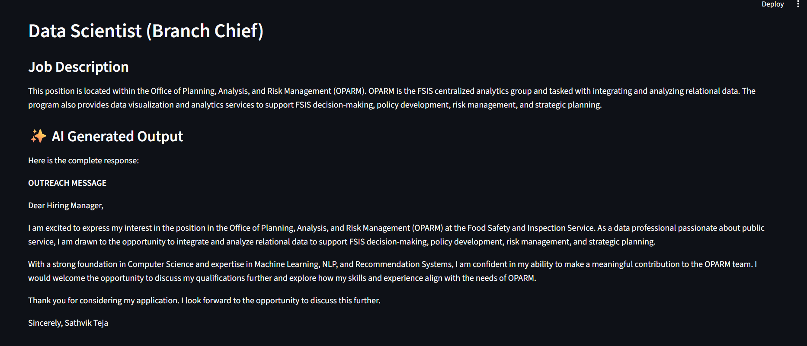

# AI Job Hunt Assistant 🤖

An AI-powered multi-agent system that helps automate job applications by analyzing job descriptions and generating tailored resumes, cover letters, and outreach messages.

## 🚀 Features

* Fetch jobs from **USAJobs API**
* Multi-agent pipeline using **CrewAI**
* **Resume tailoring** based on job description
* **Cover letter generation**
* **Recruiter outreach message generation**
* **Application logging** (CSV)
* **Streamlit web interface**

## 🧠 Architecture

User Input (Resume + Bio + Job Search)
↓
USAJobs API
↓
CrewAI Agents

* JD Analyst Agent
* Resume Generator Agent
* Messaging Agent
  ↓
  Generated Output
* Resume summary
* Cover letter
* Outreach message
  ↓
  Application tracking + file storage

## 🛠 Tech Stack

* Python
* CrewAI
* Ollama (Llama3)
* Streamlit
* USAJobs API

## ▶ Run Locally

Install dependencies

pip install -r requirements.txt

Run the app

streamlit run streamlit_app.py
Note: Deployment requires a hosted LLM provider (Groq/OpenAI). Local development uses Ollama.

## 📌 Future Improvements

* Job similarity ranking using embeddings
* Job recommendation system
* ATS scoring
* RAG-based job understanding
* Deployment with Streamlit Cloud
  
#DEMO1

#DEMO2

#DEMO3

#DEMO4

#DEMO5

#DEMO6

